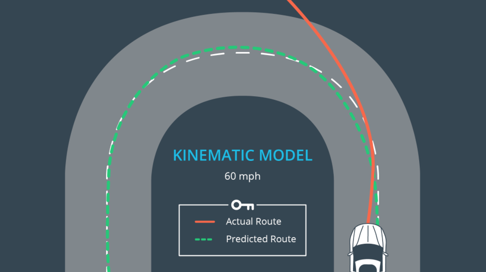
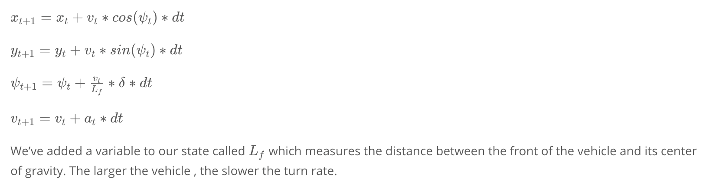

# CarND-Controls-MPC
Self-Driving Car Engineer Nanodegree Program

---

## Overview
This project makes use of a Model Predictive Controller to guide a car around a race track in the Udacity simulator. Not only does it provide a much smoother route than a PID controller but it can easily handle a delay in actuations.

## Model
Model Predictive Control involves simulating a series of actuator inputs (steering, accelerator), predicting the resulting trajectories and selecting the trajectory with the minimum cost.
With the found, lowest cost trajectory we implement only the first actuation command and throw away the rest. We then take our new state and use that once again to predict future trajectories, starting the process over.

For this project we have used a kinematic model of the car, which is a simplification of a full dynamic model, ignoring the effects of tyre forces, gravity and mass.

At low and moderate speeds kinematic models are a good approxmation.

The state vector for our kinematic model is made up of [x, y, ψ, ν, δ, a], where
- x is the cars x position
- y is the cars y position
- ψ (psi) is the cars angle in radians from the x-direction
- ν is the cars velocity
- δ (delta) is the steering input in radians
- a is the cars accelerator input

Note how we have appended the atuations (δ, a) to the state vector.
Below are the kinematic equations or motion model for our car.

We fit a polynomial to the way points around the track (in this project we have chosen a 3rd order polynomial) to specify the reference trajectory.

We wish to minimise the error between the reference trajectory and the vehicles path. In doing so we must calculate the error - made up of *cte* and *epsi*.

The general steps taken during processing are as follows:

main.cpp
- The telemetry from the Udacity simulator provides us with a series of waypoints - the closest 6 in front of the car. These are in global coordinates so first we must convert them to the cars reference frame
- Fit a 3rd order polynomial to the waypoints
- Calculate the cte and epsi error values. cte calculated by evaluating the polynomial at the cars x position (which is 0 in the cars reference frame), then subtracting py. The epsi value is calculated as follows: -atan(`derivative of fitted ploynomial`)
- Set the current state vector
- We then use a nonlinear solver (this project makes use of IPopt) to determine the best trajectory and set the next steering and throttle command to the first determined actuations.

MPC.cpp
- The solve function sets up our variables and constraints and solves the problem using he passed in `FG_eval` object.
- `FG_eval` is called by the solver and specifies our cost function and some further constraints. Adjusting the cost function as well as the global `N` and `dt` values is what is required to tune the model.

## Tuning
The cost function is broken up into 3 separate additive components:
1. The reference state
2. Minimise the use of actuators
3. Minimise the difference between successive actuations

Tuning the weight applied to each of these parts is required to ensure the car drives smoothly and can successfully get around the track with as little error as possible.

See ine #57 of MPC.cpp for the weights of each cost component I have chosen. There operate in tandem with the global parameters `N` and `dt`.
`N` is the number of timesteps into the future. `dt` is the time between each activation. Multiplying these together give the prediction horizon (the duration over which future predictions are made, or T).

T should not be more than a few seconds at most. Beyond this, the environment may have changed too much.

I have chosen a value of T at 1.5 seconds with `N = 10` and `dt = 0.15`.
Combined with the cost function tuning from line #56 of MPC.cpp this allows the car to travel very smoothly at a speed of 60mph (slowing where necessary for the corners automatically).

These parameters were determined empirically by continually varying each and checking the cars performance, first at a slow speed of 20mph. Once good parameters were found I gradually increaed the reference speed.

Once the reference speed goes above 60mph we notice that at certain places around the track the solver is unable to find a usable result (this is when the green line goes crazy). This only occurs for a split second and does not effect the cars performance up to around 80mph.

Note that the above parameter-tuning handles the 100msec actuator delay (which is mocked in main.cpp to approximate the real delay in actuating a real vehicle). In fact I found very little difference with out without the delay showing the strength of the MPC model as opposed to PID which overshoots when delays are encountered.

## Dependencies

* cmake >= 3.5
 * All OSes: [click here for installation instructions](https://cmake.org/install/)
* make >= 4.1
  * Linux: make is installed by default on most Linux distros
  * Mac: [install Xcode command line tools to get make](https://developer.apple.com/xcode/features/)
  * Windows: [Click here for installation instructions](http://gnuwin32.sourceforge.net/packages/make.htm)
* gcc/g++ >= 5.4
  * Linux: gcc / g++ is installed by default on most Linux distros
  * Mac: same deal as make - [install Xcode command line tools]((https://developer.apple.com/xcode/features/)
  * Windows: recommend using [MinGW](http://www.mingw.org/)
* [uWebSockets](https://github.com/uWebSockets/uWebSockets) == 0.14, but the master branch will probably work just fine
  * Follow the instructions in the [uWebSockets README](https://github.com/uWebSockets/uWebSockets/blob/master/README.md) to get setup for your platform. You can download the zip of the appropriate version from the [releases page](https://github.com/uWebSockets/uWebSockets/releases). Here's a link to the [v0.14 zip](https://github.com/uWebSockets/uWebSockets/archive/v0.14.0.zip).
  * If you have MacOS and have [Homebrew](https://brew.sh/) installed you can just run the ./install-mac.sh script to install this.
* [Ipopt](https://projects.coin-or.org/Ipopt)
  * Mac: `brew install ipopt --with-openblas`. **WARNING** - I found I had to install without the openblas switch: `brew install ipopt`. When using the --with-openblas switch the project still builds fine; however the results from the solver are not valid!
  * Linux
    * You will need a version of Ipopt 3.12.1 or higher. The version available through `apt-get` is 3.11.x. If you can get that version to work great but if not there's a script `install_ipopt.sh` that will install Ipopt. You just need to download the source from [here](https://www.coin-or.org/download/source/Ipopt/).
    * Then call `install_ipopt.sh` with the source directory as the first argument, ex: `bash install_ipopt.sh Ipopt-3.12.1`. 
  * Windows: TODO. If you can use the Linux subsystem and follow the Linux instructions.
* [CppAD](https://www.coin-or.org/CppAD/)
  * Mac: `brew install cppad`
  * Linux `sudo apt-get install cppad` or equivalent.
  * Windows: TODO. If you can use the Linux subsystem and follow the Linux instructions.
* [Eigen](http://eigen.tuxfamily.org/index.php?title=Main_Page). This is already part of the repo so you shouldn't have to worry about it.
* Simulator. You can download these from the [releases tab](https://github.com/udacity/CarND-MPC-Project/releases).

## Basic Build Instructions

1. Clone this repo.
2. Make a build directory: `mkdir build && cd build`
3. Compile: `cmake .. && make`
4. Run it: `./mpc`.

## Tips

1. It's recommended to test the MPC on basic examples to see if your implementation behaves as desired. One possible example
is the vehicle starting offset of a straight line (reference). If the MPC implementation is correct, after some number of timesteps
(not too many) it should find and track the reference line.
2. The `lake_track_waypoints.csv` file has the waypoints of the lake track. You could use this to fit polynomials and points and see of how well your model tracks curve. NOTE: This file might be not completely in sync with the simulator so your solution should NOT depend on it.
3. For visualization this C++ [matplotlib wrapper](https://github.com/lava/matplotlib-cpp) could be helpful.

## Editor Settings

We've purposefully kept editor configuration files out of this repo in order to
keep it as simple and environment agnostic as possible. However, we recommend
using the following settings:

* indent using spaces
* set tab width to 2 spaces (keeps the matrices in source code aligned)

## Code Style

Please (do your best to) stick to [Google's C++ style guide](https://google.github.io/styleguide/cppguide.html).

## Project Instructions and Rubric

Note: regardless of the changes you make, your project must be buildable using
cmake and make!

More information is only accessible by people who are already enrolled in Term 2
of CarND. If you are enrolled, see [the project page](https://classroom.udacity.com/nanodegrees/nd013/parts/40f38239-66b6-46ec-ae68-03afd8a601c8/modules/f1820894-8322-4bb3-81aa-b26b3c6dcbaf/lessons/b1ff3be0-c904-438e-aad3-2b5379f0e0c3/concepts/1a2255a0-e23c-44cf-8d41-39b8a3c8264a)
for instructions and the project rubric.

## Hints!

* You don't have to follow this directory structure, but if you do, your work
  will span all of the .cpp files here. Keep an eye out for TODOs.

## Call for IDE Profiles Pull Requests

Help your fellow students!

We decided to create Makefiles with cmake to keep this project as platform
agnostic as possible. Similarly, we omitted IDE profiles in order to we ensure
that students don't feel pressured to use one IDE or another.

However! I'd love to help people get up and running with their IDEs of choice.
If you've created a profile for an IDE that you think other students would
appreciate, we'd love to have you add the requisite profile files and
instructions to ide_profiles/. For example if you wanted to add a VS Code
profile, you'd add:

* /ide_profiles/vscode/.vscode
* /ide_profiles/vscode/README.md

The README should explain what the profile does, how to take advantage of it,
and how to install it.

Frankly, I've never been involved in a project with multiple IDE profiles
before. I believe the best way to handle this would be to keep them out of the
repo root to avoid clutter. My expectation is that most profiles will include
instructions to copy files to a new location to get picked up by the IDE, but
that's just a guess.

One last note here: regardless of the IDE used, every submitted project must
still be compilable with cmake and make./
